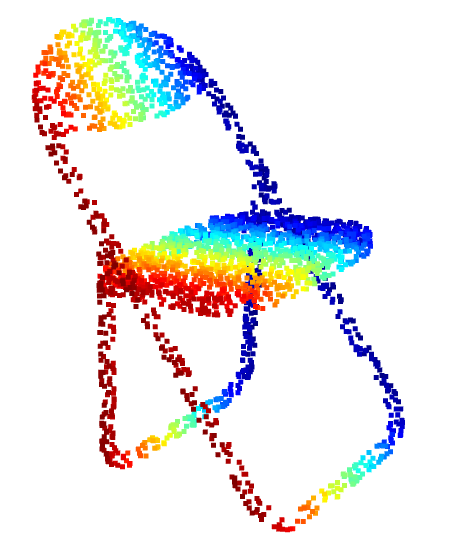
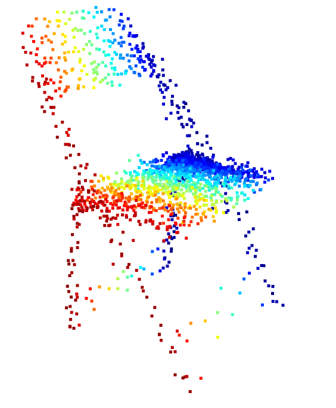
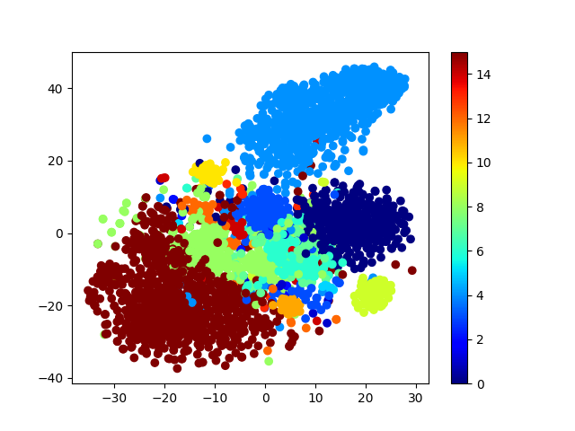

# PointCloudVAE
valiational autoencoder of pointcloud </br>
**CAUTION:**</br>
Changes may be made to test various things.


## Environmet
- python 3.8.10
- cuda 11.6
- pytorch 1.32.1
- pytorch3d 0.7.2
- open3d 0.13.0

## Dataset
ShapeNet Dataset from [[url]]

## Usage
training
```python
python train.py
```
evaluation
```python
python eval.py -d "directory name of tar path which you want to test"
```
Settings for training and evaluation are in [options.py](https://github.com/GenMNL/PointCloudVAE/blob/main/options.py).

## Result

### AutoEncoder
ground truth
 
latent dim = 1024
 

### Visualizing latent space
latent dim = 1024 (visualizing by t-sne)
 
